# 🚦 Smart Traffic Management System

## 📖 Overview

The **Smart Traffic Management System** is a practical project designed to replicate real-world traffic management in a city.It is a dynamic traffic management system designed to simulate a city's road network. The system supports essential functionalities like managing intersections, displaying traffic statuses, handling blocked and under-repair roads, and routing vehicles through the network.

---

# ✨ Features

## Graph Representation:
- Represent the city's road network as a directed graph with intersections as vertices and roads as edges.
- Support for dynamic graph updates, including adding and removing vertices and edges.

## Interactive Dashboard:
- **Interactive Console Menu** for users to manage the simulation and handle operations, including:
  - Display the traffic network in the form of an adjacency list.
  - Block, unblock, or mark roads as under repair dynamically.
  - Handle emergency and regular vehicle routing.
  - Manage traffic lights.

## Blocked and Under-Repair Roads:
- Mark roads as blocked or under repair, and ensure routing algorithms respect these road statuses.
- Dynamic updates on road conditions with real-time display of blocked and under-repair roads.

## Pathfinding Algorithms:
- **Dijkstra's Algorithm**: Find and display the shortest path between two intersections while considering road conditions.
- **Breadth-First Search (BFS)** / **Depth-First Search (DFS)**: Explore all possible paths between two intersections, regardless of road conditions.
- **Traffic-Aware Pathfinding**: Automatically account for road closures, repairs, or accidents when calculating paths.

## Congestion Monitoring:
- Real-time tracking of traffic congestion based on the number of vehicles in different areas of the city.
- Congestion status can be displayed and updated based on vehicle movement and road conditions.

## Emergency Vehicle Routing:
- Prioritize emergency vehicles (e.g., ambulances, fire trucks) in the traffic system, enabling faster and safer paths during emergencies.
- Dynamically reroute emergency vehicles, bypassing congested or blocked areas for optimal response times.
- Handle special **emergency vehicle routing** algorithms that factor in road conditions and vehicle priorities.

## Traffic Lights Management:
- Control **traffic light timings** for intersections, allowing dynamic adjustments to optimize traffic flow.
- Traffic light status can be updated manually or automatically based on real-time congestion and vehicle movement data.
- Integration with vehicle routing to ensure that traffic lights are synchronized with the flow of traffic.

## CSV Data Support:
- Load **road network** and **road closure** data from **CSV files** for seamless integration with real-world data or simulation updates.
- Support for importing and exporting traffic data to facilitate further analysis or reporting.

## Vehicle Simulation:
- Simulate the movement of **regular vehicles** and **emergency vehicles** across the road network.
- Dynamic vehicle routing that adapts to road conditions and traffic management settings.
- Track and manage vehicle attributes such as **speed**, **position**, and **destination**.

## Real-Time Data Updates:
- Monitor and update road conditions, vehicle positions, and other relevant data in real-time to reflect the current status of the simulation.
- Provides users with an up-to-date view of the simulation as it evolves.


---

## 🛠️ Setup Instructions


## Prerequisites

- A **C++ compiler** supporting **C++11** or later (e.g., GCC/Clang/MSVC).
- **SFML 2.61** (Simple and Fast Multimedia Library) installed.
- **Make** installed for building the project.
- A **terminal** or **IDE** (e.g., VSCode, CLion) for compilation and execution.
- Run this in ubunbu for visualization and sfml (preferrable).If you wan to use this in Windows then comment the visual part of download specific version of sfml and change a code for it.
## Step-by-Step Setup

### 1. Clone the GitHub Repository

Open a terminal and run the following command to clone the repository:

```bash
git clone https://github.com/your-username/your-repository-name.git
cd your-repository-name

```

### 2. Install SFML 2.61

Make sure SFML 2.61 is installed on your system. Follow the installation instructions for your operating system:

#### For Ubuntu :

```bash
sudo apt-get update
sudo apt-get install libsfml-dev
```

### 3. Ensure Make is installed

Make sure that Make is installed on your machine. If not, install it:

#### For Ubuntu :

```bash
sudo apt-get install build-essential
```
### 4. Build the Project Using Make

Navigate to your project directory in the terminal, where the Makefile is located, and run:

#### For Ubuntu :

```bash
make
```

### 5. Run the Program

Once the project is compiled, run the program with:

#### For Ubuntu :

```bash
./app
```


## Class Diagram

```mermaid
classDiagram
    class Vertex {
        +string name
        +EdgeNode* edges
        +Vertex(string name)
    }

    class Edge {
        +Vertex* destination
        +int travelTime
        +bool blocked
        +bool underRepaired
        +isBlocked() bool
        +setBlocked(bool status)
        +isUnderRepaired() bool
        +setUnderRepaired(bool status)
        +Edge(Vertex* destination, int travelTime)
    }

    class EdgeNode {
        +Edge* edge
        +EdgeNode* next
        +EdgeNode(Edge* edge)
    }

    class VertexNode {
        +Vertex* vertex
        +VertexNode* next
        +VertexNode(Vertex* vertex)
    }

    class Graph {
        +VertexNode* headVertex
        +addVertex(string name)
        +findVertex(string name)
        +addEdge(string start, string end, int travelTime)
        +loadRoadData(string filename)
        +displayRoadStatuses()
        +markEdgeAsBlocked(string intersection1, string intersection2, bool isBlocked)
        +markEdgesAsUnderRepaired(string intersection1, string intersection2, bool isUnderRepaired)
        +displayBlockedEdges()
        +addEdgeToVertex(Vertex* vertex, Edge* edge)
        +printAdjacencyList()
        +isBlocked(string nodeName1, string nodeName2)
        +getNeighbors(string nodeName, string* neighbors, int& count)
        +getEdgeWeight(string start, string end)
        +getVertices(string* vertices, int& count)
        +getVertexCount()
        +getAllEdges(string edges[][3], int& count)
    }

    class Accident_roads {
        +AccidentNode* head
        +AccidentNode* underRepairHead
        +blockRoad(string start, string end, Graph& cityGraph)
        +Accident_roads()
        +~Accident_roads()
        +loadRoadData(Graph& graph)
        +markIntersectionsAsBlocked(Graph& graph, string intersection1, string intersection2, bool isBlocked)
        +displayBlockedIntersections(Graph& graph)
        +displayUnderRepairIntersections(Graph& graph)
        +displayBlockedRoads()
        +displayUnderRepairRoads()
    }

    class AccidentNode {
        +string intersection1
        +string intersection2
        +bool isBlocked
        +AccidentNode* next
        +AccidentNode(string i1, string i2, bool blocked)
    }

    class CongestionMaxHeap {
        +RoadNode* root
        +inorder(RoadNode* root)
        +CongestionMaxHeap()
        +makeHeap(RoadNode* hashTableArray, int size)
        +insert(RoadNode* newNode)
        +heapifyUp(RoadNode*& newNode)
        +printHeap()
        +mostCongested() RoadNode*
        +inorder()
        +heapifyDown(RoadNode* node)
    }

    class CongestionMonitoring {
        +const int hashTableSize
        +RoadNode hashTable[HASH_TABLE_SIZE]
        +CongestionMonitoring(Vehicle* vehiclesHead)
        +makeHashTable(Vehicle* vehiclesHead)
        +updateHashTable(Vehicle* prevPos, Vehicle* currentPos)
        +printHashTable()
        +deleteTable()
        +findRoadNode(char start, char end)
        +getTravelTime(char start, char end, int prevTime) int
        +getTravelTime(char start, char end, Graph& cityGraph) int
        +numberOfCongestionEvents()
    }

    class RoadNode {
        +char start
        +char end
        +int congestionCount
    }

    class Vehicles {
        +Vehicle* head
        +Vehicles()
        +~Vehicles()
        +insertAtHead(string VehicleID, string startIntersection, string endIntersection, string priorityLevel)
        +enqueue(string VehicleID, string startIntersection, string endIntersection, string priorityLevel)
        +insertAfterPosition(int position, string VehicleID, string startIntersection, string endIntersection, string priorityLevel)
        +insertAfterID(string ID, string VehicleID, string startIntersection, string endIntersection, string priorityLevel)
        +deleteAtStart()
        +deleteAtEnd()
        +deleteAtIndex(int position)
        +deleteAtID(string ID)
        +isEmpty()
        +printVehicles()
        +findIDInVehicles(string vehicleID)
        +loadAndReadCSVs()
        +getHead()
        +addPaths(GPS& gps)
    }

    class Vehicle {
        +string vehicleID
        +string startIntersection
        +string endIntersection
        +string priorityLevel
        +string* path
        +int currentIntersectionInPath
        +int pathLength
        +bool presetPath
        +Vehicle* next
        +Vehicle(string vehicleID, string startIntersection, string endIntersection, string priorityLevel)
        +moveForward(string nextIntersectionId = "")
        +printVehicle()
        +setPath(string path)
        +printPath()
    }

    class TrafficSignal {
        +string state
        +int transitionTime
        +char intersectionId
        +int duration
        +TrafficSignal* next
        +TrafficSignal(string state = "red", char intersectionId = '-', int duration = 60, int transitionTime = 5)
        +getState() string
        +setState(string state)
        +display()
        +print()
        +getIntersectionId() int
        +getDuration() int
        +getTransitionTime() int
        +advanceState()
    }

    class TrafficLightManagement {
        +TrafficSignal* headSignal
        +TrafficLightManagement()
        +makeTrafficSignals()
        +updateTrafficSignals(CongestionMonitoring& ht)
        +addSignal(TrafficSignal* signal)
        +printGreenTimes()
        +getSignal(string intersection)
    }

    class GPS {
        +Graph* graph
        +int vertexCount
        +vertexNames[MAX_VERTICES]
        +getVertexIndex(string name)
        +findAllPathsDFS(Vertex* start, Vertex* end, string path[], int pathIndex, string allPaths[][MAX_VERTICES], int& allPathsCount, bool visited[], int totalWeight[], int& totalWeightCount)
        +GPS(Graph* graph)
        +printAllPaths(string startName, string endName)
        +rerouteEmergencyVehicle(string startName, string endName)
        +getPathAsString(string startName, string endName)
        +findAllOptimalPaths(Vertex* start, Vertex* end, string path[], int pathIndex, string allPaths[][MAX_VERTICES], int& allPathsCount, bool visited[], int totalWeight[], int& totalWeightCount)
        +printAllPathsDijkstra(string startName, string endName)
    }

    class RoadQueue {
        +RoadNode* head
        +RoadNode* tail
        +RoadQueue()
        +enqueue(RoadNode*& newNode)
        +dequeue()
        +printQueue()
        +isEmpty()
    }

    Vertex "1" -- "*" EdgeNode : has
    EdgeNode "*" -- "1" Edge : contains
    VertexNode "1" -- "*" Vertex : stores
    VertexNode "*" -- "1" Graph : contains
    Graph "1" -- "*" Vertex : manages
    Accident_roads "1" -- "*" AccidentNode : manages
    AccidentNode "*" -- "1" Graph : affects
    CongestionMaxHeap "1" -- "*" RoadNode : manages
    CongestionMonitoring "1" -- "*" RoadNode : tracks
    CongestionMonitoring "*" -- "*" Vehicle : monitors
    Vehicles "1" -- "*" Vehicle : manages
    TrafficSignal "1" -- "*" Vertex : controls
    TrafficLightManagement "1" -- "*" TrafficSignal : manages
    GPS "1" -- "1" Graph : uses
    RoadQueue "1" -- "*" RoadNode : manages
```


